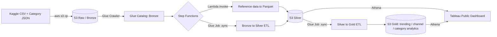

# YouTube Trending Video Data Pipeline

A serverless, medallion-architecture data pipeline on AWS that ingests the [Kaggle YouTube Trending Video dataset](https://www.kaggle.com/datasets/datasnaek/youtube-new) (10 regions), transforms it through Bronze → Silver → Gold layers using AWS Glue, orchestrates the whole thing with Step Functions, and surfaces the results in a Tableau Public dashboard.

## Architecture



## Pipeline layers

- **Bronze** — Raw CSV (10 regions, Hive-partitioned by `region=xx/`) and category-reference JSON, landed in S3 and cataloged via Glue Crawlers.
- **Silver** (`silver_statistics`) — PySpark Glue job (`glue_jobs/bronze_to_silver_statistics.py`) that dedupes exact re-ingestions per (video, trending date, region), casts types, and derives an `engagement_rate` metric ((likes + comments) / views). Self-registers to the Glue Catalog via `enableUpdateCatalog`.
- **Gold** — Three analytics tables built from Silver (`glue_jobs/silver_to_gold_analytics.py`):
  - `trending_analytics` — daily regional rollups (video count, total views, avg engagement, distinct channels/categories)
  - `channel_analytics` — channel performance ranked within each region
  - `category_analytics` — category view-share percentage per region/day
- **Orchestration** — An AWS Step Functions state machine (`step_functions/pipeline_orchestration.json`) runs the reference-data Lambda (`lambdas/json_to_parquet/lambda_function.py`) and the Bronze→Silver Glue job in parallel, then triggers Silver→Gold once both complete, with retry/backoff on each step.

## Tech stack

AWS S3 · AWS Lambda (Python) · AWS Glue (PySpark, Crawlers, Data Catalog) · Amazon Athena · AWS Step Functions · IAM · Tableau Public

## Engineering challenges solved

This project involved debugging a real, non-trivial AWS pipeline end to end rather than just following a tutorial:

- **Silent Lambda deployment failures** — traced a "Hello from Lambda!" default response back to code that had been saved but never actually deployed, then to a memory-starvation timeout caused by config edits that weren't actually persisted.
- **Glue Catalog path collisions** — diagnosed an `InvalidArgumentValue` error caused by two different pipeline stages trying to register the same table name against conflicting S3 paths in the same database, and resolved it with clean database separation between layers.
- **Athena type-mismatch joins** — fixed a `TYPE_MISMATCH: bigint = varchar` join error caused by inconsistent typing between a numeric source field and a string-typed reference field, and worked through two separate causes of duplicate rows (daily snapshot grain vs. multi-region trending) to get a correct top-N query.
- **AWS Glue's native CSV reader failing on real-world malformed data** — one source file (`RUvideos.csv`) has rows with unbalanced quote characters that crash Glue's built-in `JacksonReader` with a `FatalException`. Diagnosed via CloudWatch stack traces and fixed by switching the Bronze read step to Spark's native CSV reader with `mode="DROPMALFORMED"`, recovering full 10-region coverage instead of silently dropping regions.
- **Idempotency under orchestration** — caught that a Lambda originally built for a single manual run would create duplicate reference-data rows on every repeated Step Functions execution, and fixed the write mode (`overwrite` instead of `append`) before wiring it into automated orchestration.
- **AWS free-tier constraints** — when QuickSight proved unavailable on a Free Plan AWS account (a documented AWS limitation, not a bug), pivoted the visualization layer to Tableau Public rather than incurring unplanned billing.

## Dashboard

Built in Tableau Public: top trending videos, category breakdown by peak views, and a distribution of how many regions each video trended in. [Add your published Tableau Public link here]

## Repo structure

```
.
├── README.md
├── lambdas/
│   └── json_to_parquet/
│       └── lambda_function.py       # Converts category-reference JSON to Parquet, registers to Glue Catalog
├── glue_jobs/
│   ├── bronze_to_silver_statistics.py   # Bronze -> Silver: dedupe, type-cast, engagement_rate
│   └── silver_to_gold_analytics.py      # Silver -> Gold: trending / channel / category analytics tables
└── step_functions/
    └── pipeline_orchestration.json  # State machine chaining Lambda + both Glue jobs
```

## Setup

All infrastructure is provisioned and run via AWS CLI (see the commands below). Requires an AWS account, `aws configure`'d credentials, and the Kaggle dataset uploaded to an S3 bucket partitioned by `region=xx/`.

1. Upload the Kaggle dataset to S3, partitioned as `s3://<raw-bucket>/<prefix>/region=xx/XXvideos.csv` for each of the 10 regions, plus the category-reference JSON files.
2. Run a Glue Crawler over the raw bucket to populate the Bronze Glue Catalog table.
3. Upload the scripts in `glue_jobs/` to S3 and create the two Glue jobs with `aws glue create-job`.
4. Deploy the Lambda in `lambdas/json_to_parquet/` with the AWS SDK for pandas (awswrangler) layer attached.
5. Create the Step Functions state machine from `step_functions/pipeline_orchestration.json`, swapping `<YOUR_AWS_ACCOUNT_ID>` and pointing its resource ARNs at your own Lambda/Glue job names.
6. Run the pipeline with `aws stepfunctions start-execution`.
7. Query the Gold tables (or Silver directly) via Athena and connect Tableau Public to the exported results.
